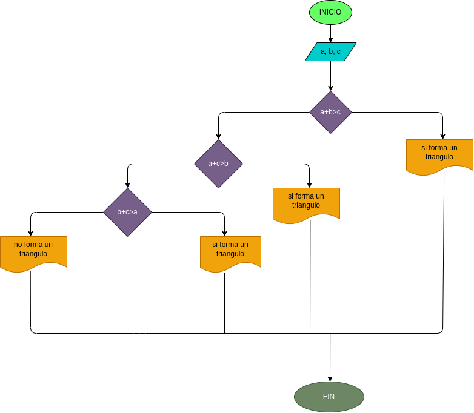

# Quiz instrucciones condicionales

### Realice el análisis, diseño y construcción para resolver el siguiente problema:

Dados tres números a, b y c, correspondientes a la longitud de los lados de una figura geométrica, determinar si pueden formar los lados de un triángulo.

## DISEÑO

### Diagrama de flujo
